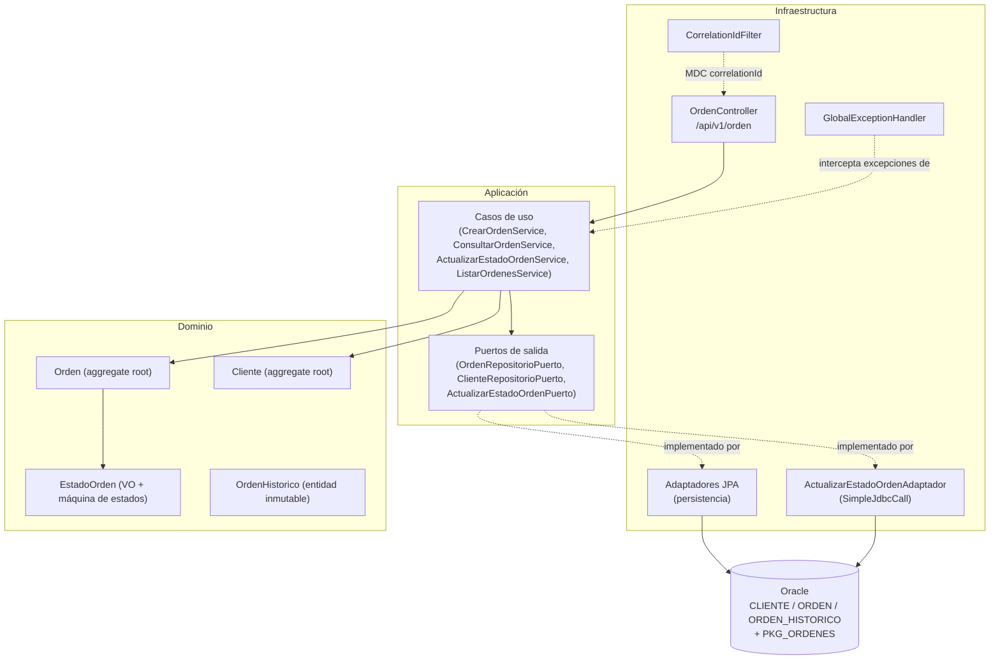

# Arquitectura

## Capas hexagonales



Regla de dependencia: **dominio → nada**, **aplicación → dominio**, **infraestructura → aplicación + dominio**. Se verifica automáticamente con `ArquitecturaHexagonalTest` (ArchUnit).

## Paquetes

```
com.sysman.ordenes
├── dominio
│   ├── modelo       Orden, Cliente, OrdenHistorico, EstadoOrden, TipoOrden
│   ├── excepcion    OrdenNoEncontradaException, ClienteNoEncontradoException,
│   │                TransicionEstadoInvalidaException, ConflictoVersionOrdenException
│   └── servicio     ValidadorTransicionEstado
├── aplicacion
│   ├── puerto/entrada   CrearOrdenUseCase, ConsultarOrdenUseCase,
│   │                    ActualizarEstadoOrdenUseCase, ListarOrdenesUseCase
│   ├── puerto/salida    OrdenRepositorioPuerto, ClienteRepositorioPuerto,
│   │                    ActualizarEstadoOrdenPuerto
│   ├── dto/comando      CrearOrdenComando, ActualizarEstadoComando, ListarOrdenesComando
│   ├── dto/resultado    OrdenResultado, PaginaResultado
│   └── servicio         CrearOrdenService, ConsultarOrdenService,
│                        ActualizarEstadoOrdenService, ListarOrdenesService
└── infraestructura
    ├── entrada/rest             OrdenController, DTOs request/response, OrdenRestMapper, OpenApiConfig
    ├── salida/persistencia/jpa  entidades JPA, repositorios Spring Data, Specifications,
    │                            mappers manuales, adaptadores
    ├── salida/procedimiento     ActualizarEstadoOrdenAdaptador, OraclePlSqlExceptionTranslator
    └── transversal              CorrelationIdFilter, GlobalExceptionHandler
```

## Por qué mono-módulo Maven

Un solo bounded context (Órdenes), un solo desarrollador y un alcance de prueba técnica acotado — separar `dominio`/`aplicacion`/`infraestructura` en artefactos Maven independientes añadiría ceremonia de build sin beneficio real a este tamaño. El aislamiento arquitectónico se garantiza igual de estrictamente con el test ArchUnit, que falla el build si `dominio` importa Spring, JPA o infraestructura. Ver ADR-001 en [`decisiones-tecnicas.md`](decisiones-tecnicas.md).
