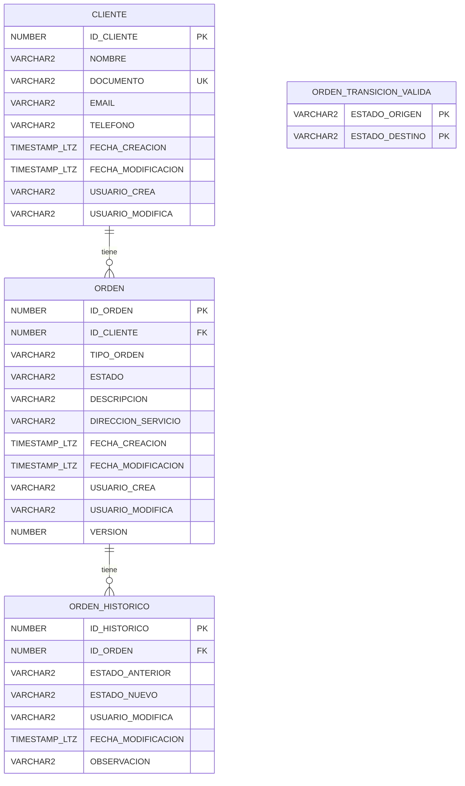

# Modelo de datos (Oracle)

## Diagrama entidad-relación

`ORDEN_TRANSICION_VALIDA` no tiene FK hacia `ORDEN` — es una tabla de configuración pura, consultada por `SP_ACTUALIZAR_ESTADO_ORDEN` (ver [`decisiones-tecnicas.md`](decisiones-tecnicas.md), ADR-004).

## Índices

| Índice | Tabla | Columnas | Tipo | Propósito |
|---|---|---|---|---|
| `PK_CLIENTE` | CLIENTE | ID_CLIENTE | B-Tree único | PK |
| `UQ_CLIENTE_DOCUMENTO` | CLIENTE | DOCUMENTO | B-Tree único | Evitar clientes duplicados |
| `PK_ORDEN` | ORDEN | ID_ORDEN | B-Tree único (global) | PK |
| `IDX_ORDEN_CLIENTE` | ORDEN | ID_CLIENTE | B-Tree normal | FK, evita bloqueo de tabla completa |
| `IDX_ORDEN_ESTADO_FECHA` | ORDEN | ESTADO, FECHA_CREACION | B-Tree compuesto | `GET /orden?estado=&fechaInicio=&fechaFin=` |
| `PK_ORDEN_HISTORICO` | ORDEN_HISTORICO | ID_HISTORICO | B-Tree único (global) | PK |
| `IDX_HIST_ORDEN` | ORDEN_HISTORICO | ID_ORDEN | B-Tree normal | FK |

## Particionamiento

`ORDEN` y `ORDEN_HISTORICO` usan `PARTITION BY RANGE (...) INTERVAL (NUMTOYMINTERVAL(1,'MONTH'))` sobre `FECHA_CREACION`/`FECHA_MODIFICACION` respectivamente. Con 1M órdenes/mes esperadas:

- Las consultas recientes (el caso más común de `GET /orden?fechaInicio=&fechaFin=`) solo tocan la partición del mes correspondiente, en vez de escanear todo el histórico.
- El mantenimiento (purga o archivado de datos antiguos) se resuelve con `DROP PARTITION`/`EXCHANGE PARTITION` en vez de un `DELETE` masivo.
- Trade-off aceptado sobre el índice global de la PK: ver ADR-006 en [`decisiones-tecnicas.md`](decisiones-tecnicas.md).

## Campos auditables

Todas las tablas de negocio (`CLIENTE`, `ORDEN`) tienen `FECHA_CREACION`, `FECHA_MODIFICACION`, `USUARIO_CREA`, `USUARIO_MODIFICA`. `ORDEN_HISTORICO` es en sí misma el mecanismo de auditoría de cambios de estado, con columnas inmutables pobladas exclusivamente por `SP_ACTUALIZAR_ESTADO_ORDEN`.

## Matriz de transición de estados

Debe mantenerse sincronizada entre `ORDEN_TRANSICION_VALIDA` (Oracle, autoridad final) y `EstadoOrden` (Java, fail-fast — ver `EstadoOrdenTest`):

| Origen | Destinos válidos |
|---|---|
| CREADA | ASIGNADA, CANCELADA |
| ASIGNADA | EN_PROCESO, CANCELADA |
| EN_PROCESO | COMPLETADA, CANCELADA |
| COMPLETADA | *(terminal, sin salidas)* |
| CANCELADA | *(terminal, sin salidas)* |

## Procedimiento `SP_ACTUALIZAR_ESTADO_ORDEN`

Ubicado en `src/main/resources/db/migration/V4__procedimiento_actualizar_estado.sql`, dentro del paquete `PKG_ORDENES`. Flujo:

1. `SELECT ESTADO, VERSION ... FOR UPDATE` — bloquea la fila; si no existe, `RAISE_APPLICATION_ERROR(-20001)`.
2. Valida la transición contra `ORDEN_TRANSICION_VALIDA`; si no es válida, `RAISE_APPLICATION_ERROR(-20002)`.
3. `UPDATE ORDEN ... WHERE ID_ORDEN=? AND VERSION=?`; si `SQL%ROWCOUNT=0` (conflicto de versión), `RAISE_APPLICATION_ERROR(-20003)`.
4. `INSERT INTO ORDEN_HISTORICO` con el estado anterior/nuevo, usuario y observación.
5. `COMMIT` explícito; cualquier error hace `ROLLBACK` y re-lanza (`WHEN OTHERS`).

Los tres códigos de error se traducen a excepciones de dominio en `OraclePlSqlExceptionTranslator` y de ahí a HTTP 404/422/409 respectivamente (ver [`api.md`](api.md)).
